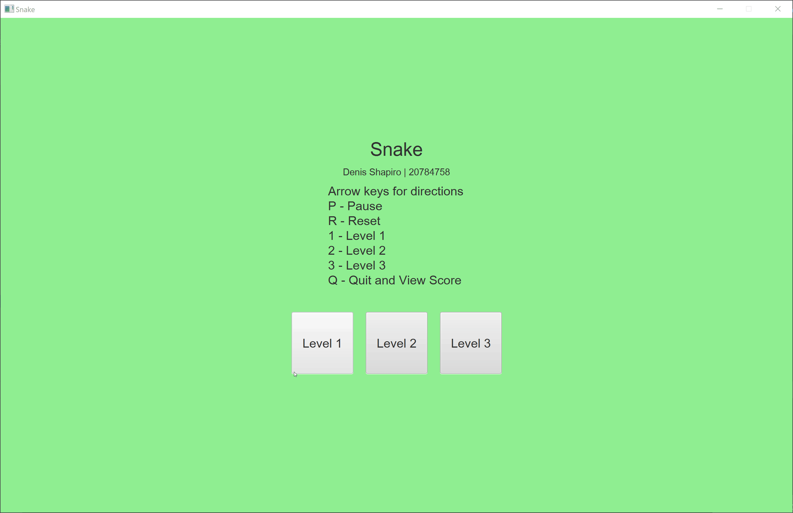

# Snake

* Denis Shapiro
* 20784758 odshapir
* openjdk version "11.0.8" 2020-07-14
* Windows 10 (Dell XPS 13 9370)

## Controls
* Arrow keys control direction
* P: pause and un-pause the game
* R: reset to the splash screen
* 1: start level 1
* 2: start level 2
* 3: start level 3
* Q: quit and display the high score screen

## Features
* 3 levels, higher levels means faster snake
* Fruit is randomly generated
    * 5 fruit at a time for level 1
    * 10 fruit at a time for level 2
    * 15 fruit at a time for level 3
* Snake grows as fruit is eaten
* Hitting an edge or itself kills the snake
* 30 second timer for level 1 and 2, play until death on level 3
* Sound effects
* Smooth animation (60 fps)

Example Gameplay:

